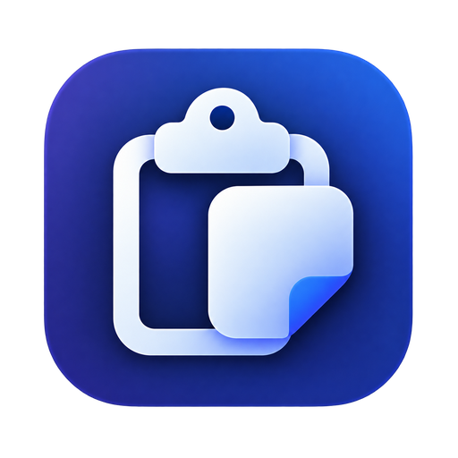
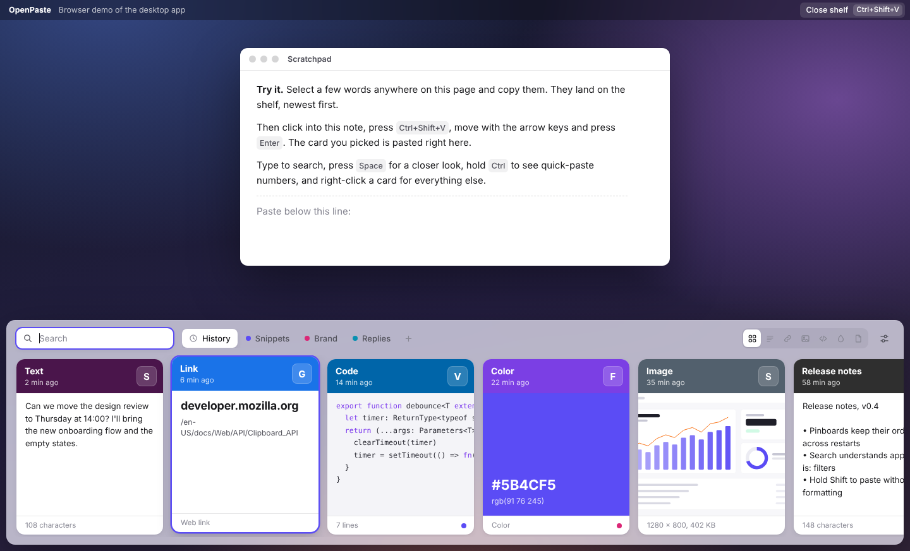
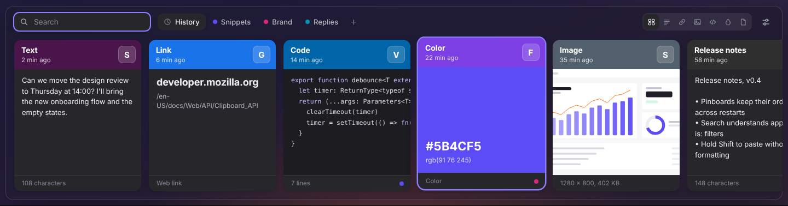

# OpenPaste

**[Download OpenPaste](https://github.com/alexsilver8/openpaste/releases/latest)** for macOS,
Windows or Linux. Free and open source.

An open-source clipboard manager for macOS, Windows and Linux. Everything you copy lands on a
visual shelf that slides up with one shortcut. Find it by typing, pick it with the arrow keys,
press Return, and it's pasted into the app you were using.



OpenPaste is an independent project inspired by the shelf-style clipboard managers on macOS. It is
not affiliated with any of them.

## What it does

- **Remembers what you copy**: text, rich text, links, code, colors, images and files, with the
  app it came from and when.
- **Shows it the way it looks**: a copied color fills its card, images go edge to edge, links lead
  with the site name, code keeps its shape with a light syntax tint.
- **Pastes for you**: choose a card and OpenPaste puts it back into the app you were using. Hold
  Shift to paste without formatting.
- **Finds things fast**: type to search across everything, or narrow it down with
  `is:image`, `is:link`, `is:code`, `is:color`, `is:file` and `app:slack`.
- **Pinboards**: save snippets, replies and brand colors to named, colored boards. Pinned items
  are never cleaned up automatically.
- **Edit before pasting**: open any card, fix the text, give it a name.
- **Private by default**: history stays on your computer. Password-manager copies are skipped,
  you can ignore whole apps, and you can pause capturing at any time.



## Keyboard

| Keys                          | Does                                                                    |
| ----------------------------- | ----------------------------------------------------------------------- |
| `⇧⌘V` / `Ctrl+Shift+V`        | Open or close the shelf (change in Settings)                            |
| `←` `→`                       | Move between cards (`⌘`/`Ctrl` jumps to ends)                           |
| `Return`                      | Paste                                                                   |
| `Shift+Return`                | Paste as plain text (or with formatting, if plain text is your default) |
| `⌘1`–`⌘9` / `Ctrl+1`–`Ctrl+9` | Paste one of the first nine cards (hold the modifier to see numbers)    |
| Just type                     | Search                                                                  |
| `Space`                       | Preview the selected card                                               |
| `⌘C` / `Ctrl+C`               | Copy without pasting                                                    |
| `⌘E` / `Ctrl+E`               | Edit text                                                               |
| `⌘R` / `Ctrl+R`               | Rename                                                                  |
| `⌘P` / `Ctrl+P`               | Pin to a pinboard                                                       |
| `⌘⌫` / `Delete`               | Delete (with undo)                                                      |
| `Tab` / `Shift+Tab`           | Switch pinboard                                                         |
| `Esc`                         | Clear the search, then close                                            |

Right-click a card for every action. Drag a card onto a pinboard tab to pin it, or out of the shelf
into another app.

## Install

Download the installer for your system from the
[latest release](https://github.com/alexsilver8/openpaste/releases/latest):

| System               | File                                                              |
| -------------------- | ----------------------------------------------------------------- |
| macOS, Apple Silicon | `OpenPaste-<version>-arm64.dmg`                                   |
| macOS, Intel         | `OpenPaste-<version>.dmg`                                         |
| Windows              | `OpenPaste Setup <version>.exe`                                   |
| Linux                | `OpenPaste-<version>.AppImage` or `openpaste_<version>_amd64.deb` |

Supported: macOS 13 or later, Windows 10 or later, and current 64-bit Linux desktops.

The installers aren't signed with a paid developer certificate yet, so the first launch needs one
extra step:

- **macOS** says it can't check OpenPaste for malicious software. Open System Settings →
  Privacy & Security, scroll down and choose Open Anyway.
- **Windows** SmartScreen may warn about an unknown publisher: More info → Run anyway.

### Permissions

- **macOS** asks for **Accessibility** access the first time you paste, because pressing ⌘V in
  another app requires it. Turn on OpenPaste in System Settings → Privacy & Security →
  Accessibility. Until then, OpenPaste copies your item and you paste it yourself.
- **Linux (X11)** pastes with `xdotool`; **Linux (Wayland)** with `wtype` or `ydotool`. Install
  one of them (`sudo apt install xdotool`). Without one, OpenPaste copies and you press Ctrl+V.
  On Wayland, global shortcuts are up to your desktop: bind a system shortcut to
  `openpaste --toggle`.
- **Windows** needs nothing extra.

## Your data

History is stored only on your computer, in a plain folder you can open from Settings:

| System  | Folder                                         |
| ------- | ---------------------------------------------- |
| macOS   | `~/Library/Application Support/OpenPaste/data` |
| Windows | `%APPDATA%\OpenPaste\data`                     |
| Linux   | `~/.config/OpenPaste/data`                     |

`history.json` is the index, `payloads/` holds the full text and formatting of each item, and
`images/` holds copied images. Unpinned items are removed after 30 days or once you pass 2,000
items; both limits are in Settings.

OpenPaste never records:

- content marked as private by password managers (the `org.nspasteboard.ConcealedType`
  convention on macOS, `ExcludeClipboardContentFromMonitorProcessing` on Windows,
  `x-kde-passwordManagerHint` on Linux),
- anything copied in an app on your ignore list (1Password, Bitwarden, KeePassXC and others by
  default),
- anything while capturing is paused.

## Develop

Requires Node.js 22.12 or newer and [pnpm](https://pnpm.io/installation) 12
(`npm install -g pnpm` if you don't have it).

```bash
pnpm install         # also downloads Electron
pnpm dev             # the app with hot reload
pnpm demo            # just the shelf UI in a browser, with sample data
pnpm test            # unit tests
pnpm typecheck
pnpm dist:mac        # or dist:win / dist:linux: installers in dist/
```

### How it fits together

```
src/
  main/            Electron main process
    watcher.ts       polls the clipboard and notices changes
    capture.ts       turns a change into a history item (type, source app, image files)
    clipboard-io.ts  reads and writes every clipboard format
    store.ts         history, pinboards, retention, undo; plain JSON on disk
    controller.ts    shelf, paste, settings and shortcut orchestration
    platform/        frontmost app detection and paste keystrokes per OS
    windows.ts       the shelf panel and the settings window
  preload/         the small, typed bridge the UI talks to
  renderer/        React UI: the shelf, settings, and the browser demo
  shared/          code both sides use: classification, search, settings, colors
tests/             Vitest suites for the shared logic and the store
```

A few decisions worth knowing:

- **No native modules.** Pasting uses each OS's own tools (CoreGraphics through `osascript` on
  macOS, a long-lived PowerShell helper on Windows, `xdotool`/`wtype` on Linux), so there is
  nothing to compile and the app builds on any machine.
- **Polling, not hooks.** No OS offers a portable "clipboard changed" event, so OpenPaste
  compares a cheap signature every 500 ms. On Windows it uses the clipboard sequence number and
  skips reading entirely when nothing changed.
- **Content-addressed images.** Copying the same screenshot twice stores it once.
- **The browser demo** runs the real shelf UI against an in-memory mock of the bridge
  (`src/renderer/src/demo/`), which also makes UI work possible without Electron.

## Roadmap

Ideas that would make good contributions:

- Sync history and pinboards between computers (end-to-end encrypted).
- Link previews (page title and image), fetched only when you opt in.
- Reordering cards inside a pinboard.
- Paste stacks: queue several items and paste them one after another.
- OCR for text inside copied images.

## Contributing

Issues and pull requests are welcome. See [CONTRIBUTING.md](CONTRIBUTING.md).

## License

[MIT](LICENSE) © 2026 Alexander Silver
